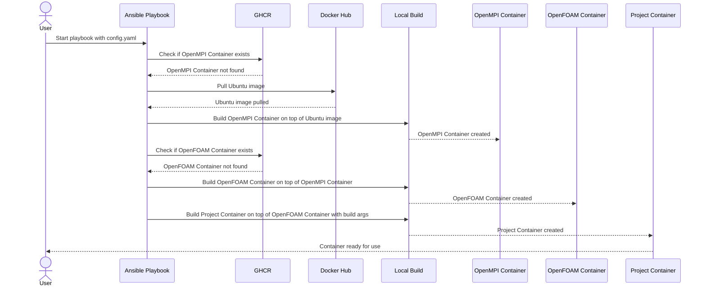

# Build apptainer containers for OpenFOAM-based projects

## Idea

Automated workflows to:

- Build a base `OpenFOAM` container (supporting different forks) to run on HPCs
- Build project-specific containers that inherit from the base container

## Quick Instructions

```bash
sudo add-apt-repository -y ppa:apptainer/ppa
sudo apt install -y apptainer
pip install ansible
ansible-playbook build.yaml --extra-vars "@config.yaml"
```

> [!NOTE]
> `ansible` is a nice tool to automate builds and make sure your host system has the required
> dependencies to be able to build the containers.

The ansible command (by default) will:
- Create the following tree in the current working folder:
```
containers/
├── basic
│   ├── opencfd-openfoam.sif
│   └── ubuntu-24.04-ompi-4.1.5.sif
└── projects
    └── test-master.sif
```
- Build a basic OpenMPI container `containers/basic/ubuntu-24.04-ompi-4.1.5.sif` 
- Build a base (OpenCFD) OpenFOAM container `containers/basic/opencfd-openfoam.sif`
- Build a test project container, to make sure MPI works alright

Check [docs.md](docs.md) for details how the configuration is expected to be structured.

Here is a simplified sequence diagram describing the expected workflow:

