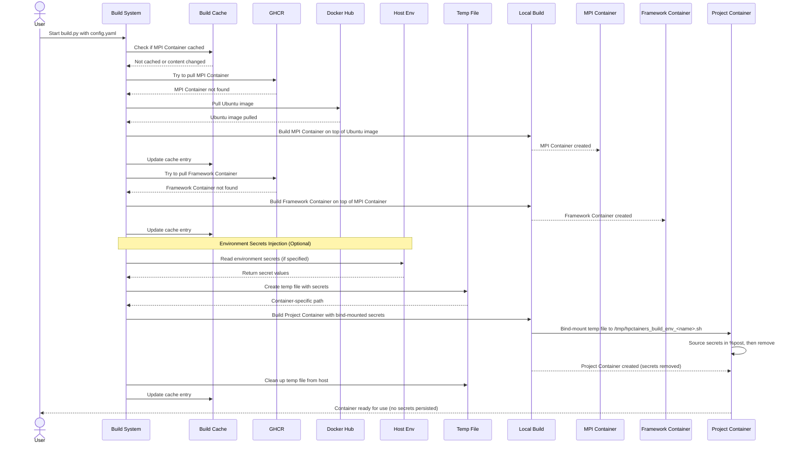

# Build apptainer containers for your projects

<p align="center">


</p>

This is a project to automate building HPC-ready containers (originally for OpenFOAM-based projects)
using `apptainer`.

> [!NOTE]
> **Migration from Ansible**: The previous Ansible-based system (`build.yaml`) has been
> replaced with a Python-based "container-as-code" system. The `config.yaml`
> format and container paths remain **fully backward compatible** so no changes are required
> to your existing configurations. `v1` tag still has the ansible-based mechanism if you want it


> [!NOTE]
> Brought to you by SDL Energy Conversion from
> <a href="https://www.nhr4ces.de/simulation-and-data-labs/sdl-energy-conversion/">
> 
> </a>
> in collaboration with
> <a href="https://ianus-simulation.de/en/">
> 
> </a>.

<!-- mtoc-start:cb9ef56 -->

* [Idea](#idea)
* [Highlighted features](#highlighted-features)
* [Quick Instructions](#quick-instructions)
* [New Features (in v2)](#new-features-in-v2)
  * [1. **Intelligent Build Caching**](#1-intelligent-build-caching)
  * [2. **Parallel Builds**](#2-parallel-builds)
  * [3. **Dependency Graph Visualization**](#3-dependency-graph-visualization)
  * [4. **Enhanced CLI**](#4-enhanced-cli)
  * [5. **Better Error Handling**](#5-better-error-handling)
  * [6. **Container-as-Code Philosophy**](#6-container-as-code-philosophy)
  * [7. **Secure Environment Secrets**](#7-secure-environment-secrets)
* [Migration from Ansible-based mechanism (v1 -> v2)](#migration-from-ansible-based-mechanism-v1---v2)

<!-- mtoc-end:cb9ef56 -->

## Idea

Automated workflows to:

- Build a base framework (eg: `OpenFOAM`) container (supporting various forks and versions) to run on HPCs
- Build project-specific containers that inherit from a target base container
- OpenMPI is a first-class citizen: `mpirun -n 16 apptainer run container.sif "solver -parallel"`
  should 'just work'.

## Highlighted features

1. Automated, configuration-only workflows to produce containers that behave similarly across frameworks.
1. A JSON Database of container metadata, with full control at the hands of the container maintainer.
1. Maintaining definition files for your projects can be done in your own repos.
1. Loading your own repositories of base framework container definitions works seamlessly.

## Quick Instructions

```bash
sudo add-apt-repository -y ppa:apptainer/ppa
sudo apt install -y apptainer
curl -LsSf https://astral.sh/uv/install.sh | sh
uvx hpctainers --config config.yaml
```

> [!TIP]
> The build system uses Python 3.10+ with `uv` for dependency management. The configuration
> file and base definitions provided serve as examples to build OpenFOAM containers.

The build command (by default) will:
- Create the following tree in the current working folder:
```
containers/
├── basic
│   ├── opencfd-openfoam.sif
│   └── ubuntu-24.04-openmpi-4.1.5.sif
└── projects
    └── test-master.sif
```
- Build a basic OpenMPI container `containers/basic/ubuntu-24.04-openmpi-4.1.5.sif`, or
  pull it from [ghcr.io](https://ghcr.io) if possible
- Build a base (OpenCFD) OpenFOAM container `containers/basic/opencfd-openfoam.sif`, or
  pull it from [ghcr.io](https://ghcr.io) if possible
- Build a test project container, to make sure MPI works alright in OpenFOAM containers

Check the [docs.md](docs.md) for details on how the configuration file
is expected to be structured.

Here is a simplified sequence diagram describing the expected workflow:


## New Features (in v2)

### 1. **Intelligent Build Caching**
- Content-based hashing of definition files and build arguments
- Automatic rebuild detection when definitions change
- Cascade rebuilds when base containers change
- Persistent cache stored in `.build-cache/`
- Use `--force-rebuild` to ignore cache

### 2. **Parallel Builds**
- Automatically builds independent containers concurrently
- Respects dependency order (MPI → Framework → Project)
- Configurable worker count: `--parallel-jobs N`
- Significant speedup for multiple container builds

### 3. **Dependency Graph Visualization**
- Generates visual dependency graphs in SVG/DOT format
- Shows build order and parallel groups
- Highlights cached containers
- Use `--graph-only` to visualize without building

### 4. **Enhanced CLI**
```bash
# Standard build
uvx hpctainers

# Force rebuild everything
uvx hpctainers --config config.yaml --force-rebuild

# Dry run (show what would be built)
uvx hpctainers --config config.yaml --dry-run

# Generate dependency graph
uvx hpctainers config.yaml --graph-only

# Build with 4 parallel jobs
uvx hpctainers config.yaml --parallel-jobs 4

# Disable registry pulls
uvx hpctainers config.yaml --no-pull

# Verbose output for debugging
uvx hpctainers config.yaml --verbose
```

### 5. **Better Error Handling**
- Per-container log files (same as before)
- Detailed error messages with context
- Graceful failure handling
- Build continues for independent containers after failures

### 6. **Container-as-Code Philosophy**
- Pure Python implementation
- Type-safe configuration parsing with Pydantic
- Modular library structure for extensibility

### 7. **Secure Environment Secrets**
- Inject host environment variables securely into container builds
- Variables sourced during %post and automatically removed
- No secrets persisted in final container image
- Container-specific temp file paths prevent conflicts
- Works across all three build methods (Python API, Shell, YAML)
- YAML: Use `env_` or `ENV_` prefix in build_args
- See [examples/environment_secrets.md](examples/environment_secrets.md) for usage

## Migration from Ansible-based mechanism (v1 -> v2)

The `config.yaml` format is **fully backward compatible**. Simply replace the build command:
```bash
# Old (Ansible)
ansible-playbook build.yaml --extra-vars="original_dir=$PWD" --extra-vars="@config.yaml"

# New (Python)
uvx hpctainers --config config.yaml
```
