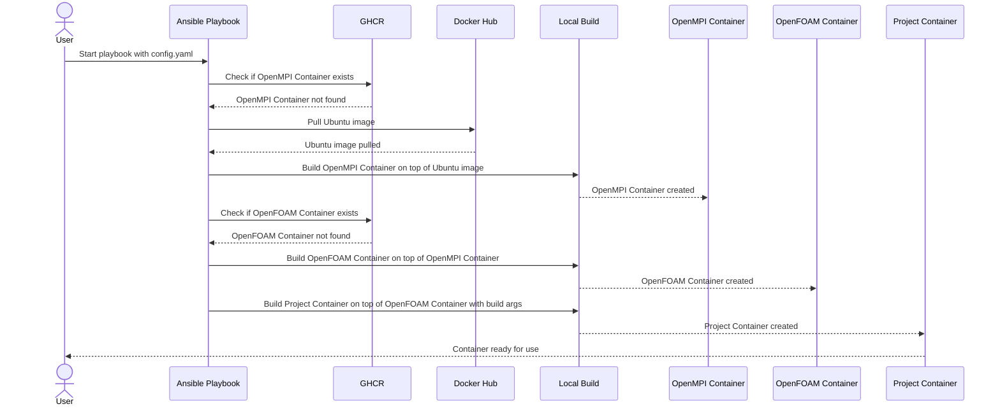

# Build apptainer containers for OpenFOAM-based projects

<p align="center">


</p>

This is a project to automate the building of HPC-ready containers for OpenFOAM-based projects
using `apptainer`.

> [!NOTE]
> Brought to you by SDL Energy Conversion from
> <a href="https://www.nhr4ces.de/simulation-and-data-labs/sdl-energy-conversion/">
> 
> </a>
> in collaboration with
> <a href="https://ianus-simulation.de/en/">
> 
> </a>.

## Idea

Automated workflows to:

- Build a base `OpenFOAM` container (supporting various forks and versions) to run on HPCs
- Build project-specific containers that inherit from a target base container
- OpenMPI is a first-class citizen: `mpirun -n 16 apptainer run container.sif "solver -parallel"`
  should 'just work'.

## Quick Instructions

```bash
sudo add-apt-repository -y ppa:apptainer/ppa
sudo apt install -y apptainer
pip install ansible
ansible-playbook build.yaml --extra-vars "original_dir=$PWD" --extra-vars "@config.yaml"
```

> [!TIP]
> `ansible` is a nice tool to automate builds and make sure your host system has the required
> dependencies to be able to build the containers.

The ansible command (by default) will:
- Create the following tree in the current working folder:
```
containers/
├── basic
│   ├── opencfd-openfoam.sif
│   └── ubuntu-24.04-ompi-4.1.5.sif
└── projects
    └── test-master.sif
```
- Build a basic OpenMPI container `containers/basic/ubuntu-24.04-ompi-4.1.5.sif`, or pull
  it from [ghcr.io](https://ghcr.io) if possible
- Build a base (OpenCFD) OpenFOAM container `containers/basic/opencfd-openfoam.sif`, or
  pull it from [ghcr.io](https://ghcr.io) if possible
- Build a test project container, to make sure MPI works alright

Check the [docs.md](docs.md) for details on how the configuration file
is expected to be structured.

Here is a simplified sequence diagram describing the expected workflow:

